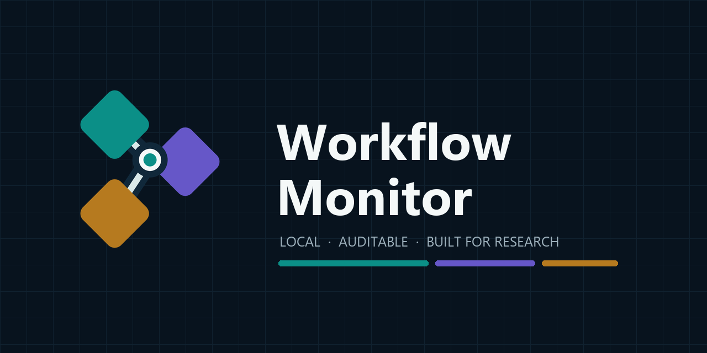
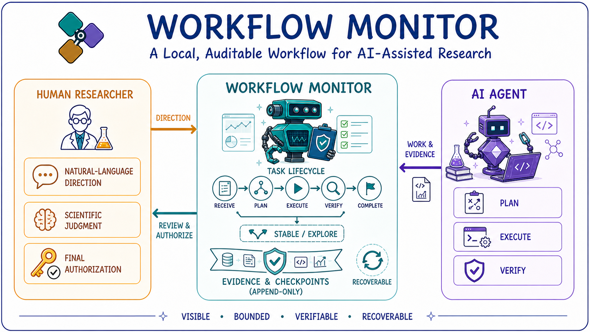
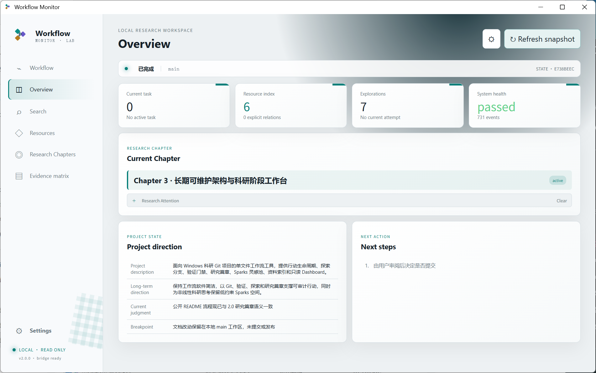

# Workflow Monitor

[简体中文](README.zh-CN.md) · [User manual](https://dawndust.github.io/workflow-monitor/) · [Download](https://github.com/DawnDust/workflow-monitor/releases/latest)

Workflow Monitor is a local, single-file workflow companion for AI-assisted scientific Git projects on Windows. It keeps tasks, Research Chapters, attempts, handoffs, resources, and release readiness visible without running a server or uploading project data.

## More output is not more control

AI can now produce code, notes, plans, experiments, and reports faster than people can reliably review them. Yet a larger stream of output does not automatically create better research. It can make the important questions harder to answer: What is the current goal? Which result was actually verified? Is this stable work or an experiment? Where did a conclusion come from, and what action did the researcher authorize?

Many approaches to automated research optimize for producing still more work. Workflow Monitor takes a deliberately more restrained path. It is not an autonomous scientist or an agent orchestrator. It is a **semi-automated research workflow with visual monitoring**: AI performs the requested work, the workflow records authoritative facts and enforces checkpoints, and the researcher keeps control of scientific judgment, direction changes, merging, and publication.

The goal is not maximum automation. The goal is to make AI-assisted work **visible, bounded, verifiable, and recoverable**—so more capability does not mean less control.

Workflow Monitor coordinates three distinct responsibilities without replacing human judgment. The researcher sets the direction, evaluates scientific meaning, and retains final authorization; the AI agent plans, executes, and verifies the requested work; and Workflow Monitor manages the task lifecycle, separates stable maintenance from exploration, records append-only evidence and checkpoints, and preserves a recoverable path through the project. Together, these roles keep AI-assisted research visible, bounded, verifiable, and accountable.

## How it works

Natural-language requests enter a structured but lightweight lifecycle. Read-only questions remain read-only; changes become explicit stable or exploratory tasks; verification and Research Chapter review must pass before completion; and external delivery actions still require user authorization.

## Why Workflow Monitor

- **One executable:** users only download `workflow-monitor.exe`; Python is not required.
- **Natural-language operation:** describe work to your AI coding agent and let the project rules drive the structured lifecycle.
- **Stable work and experiments stay distinct:** maintenance remains on `main`, while uncertain research uses explicit tracks and branches.
- **Nonlinear Research Chapters:** iterate across multiple experiments, pause one chapter to pursue another, resume temporary closures, and preserve evidence-driven judgment revisions without turning research into a rigid pipeline.
- **Local and auditable:** permanent records are append-only project files; the SQLite database is a rebuildable local projection.
- **Read-only Dashboard:** inspect Research Chapters, actions, resources, diagnostics, and release state without exposing a network port.
- **Bilingual interface:** switch between Simplified Chinese and English locally. User-authored content and recorded data are never translated.

## Quick start

Prerequisites: Windows 10/11 x64, [Git for Windows](https://git-scm.com/download/win), and the Microsoft Edge WebView2 Runtime included with current Windows installations.

1. Download `workflow-monitor.exe` from the [latest release](https://github.com/DawnDust/workflow-monitor/releases/latest).
2. Put it in a new or existing project folder. Keep the filename unchanged.
3. Double-click it. A new folder is initialized as a Git repository and the local Dashboard opens.
4. In your AI coding agent, describe the task in plain language. The repository guidance handles lifecycle commands and safety checks.

Windows SmartScreen may warn about an unsigned executable. Verify that it came from the official GitHub Release, compare its SHA-256 value with `release-manifest.json`, inspect `workflow-monitor.spdx.json`, and run `gh attestation verify workflow-monitor.exe --repo DawnDust/workflow-monitor`. The manifest states whether Authenticode signing was applied.

## Documentation and community

- [User manual](https://dawndust.github.io/workflow-monitor/)
- [中文用户手册](https://dawndust.github.io/workflow-monitor/zh/)
- [Troubleshooting](https://dawndust.github.io/workflow-monitor/troubleshooting/)
- [Changelog](CHANGELOG.md)
- [Contributing](CONTRIBUTING.md)
- [Support](SUPPORT.md)
- [Security policy](SECURITY.md)

Please use [GitHub Discussions](https://github.com/DawnDust/workflow-monitor/discussions) for usage questions, [Issues](https://github.com/DawnDust/workflow-monitor/issues) for reproducible bugs and feature proposals, and GitHub private vulnerability reporting for security issues.

## Privacy

The desktop UI binds no network port, uses no CDN, contains no telemetry, and does not automatically upload diagnostics or project data. Network access only occurs for explicit update/release checks. Diagnostic bundles are created locally and must be reviewed and attached manually.

## License

Workflow Monitor is available under the [MIT License](LICENSE).
