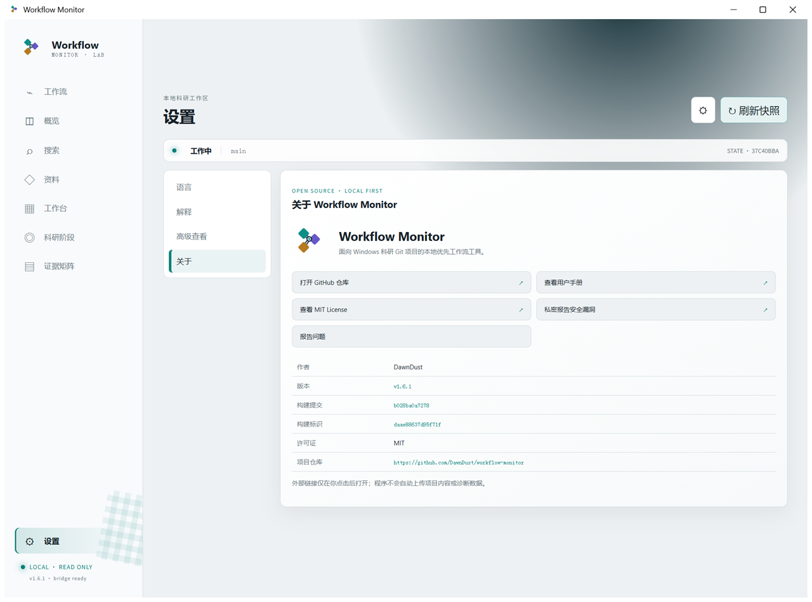

# 使用工作台

工作台用于观察和导航。生命周期写入由 AI 或高级 CLI 通过结构化服务完成。

## 主要页面

- **工作流：**活动与历史任务、动作可用性、阶段、科研探索和决策。
- **概览：**项目说明、当前阶段、判决、断点、阻塞、下一步、代码交付和资料摘要。
- **搜索：**检索任务、探索、决策和登记资料，不翻译其中内容。
- **资料：**导航七个标准资料目录，并在展开后按需读取登记条目。
- **工作台：**索引用户创建或导入的 Markdown 工具、说明、方法、流程、清单、参考和模板。
- **科研阶段：**按阶段组织主目标、完成工作、相关探索和资料。
- **设置：**语言、状态解释、高级交付和诊断视图，以及产品信息。

## 设置

“语言”只改变本机系统文字。“解释”说明已知工作流和 Git 状态。“高级查看”保留版本状态、动作可用性、诊断和原始事件；成本较高的内容仅在展开时加载。“关于”注明作者 DawnDust，并提供官方仓库、用户手册、版本、构建提交、MIT License、问题反馈和私密漏洞报告入口。

外部链接只有在用户明确点击后才会打开；项目内容和诊断数据不会自动上传。

主题和刷新按钮继续位于顶部，不属于设置配置。

## 资料和工作台条目

项目资料放在标准 `resources/` 目录并登记到索引。工作台条目是保存在 `workbench/` 下的可复用 Markdown 辅助内容。程序不会自动执行、安装、联网检查或加入日常上下文；只有用户明确选择后才会把文字复制给 AI。

## 诊断

内部故障可能生成本地轮转、脱敏的诊断记录。导出只会在本机生成 ZIP。附加到 Issue 前必须逐项检查；程序不会自动上传任何内容。
